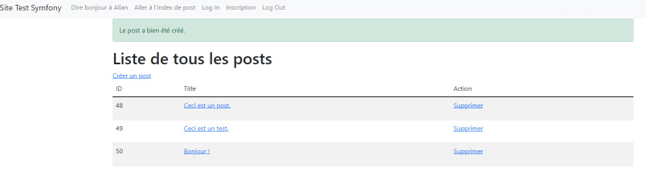

# Test Symfony

# Info 

Ceci n'est juste qu'un petit site pour tester les possibilitées de Symfony. Il y a des tests pour le routing, la création de controllers, la liaison du site web avec une base de donnée (MySQL), la création de posts et leur suppression, la possibilité de s'inscrire et de se connecter (avec le hachage des mots de passes), les rôles etc.